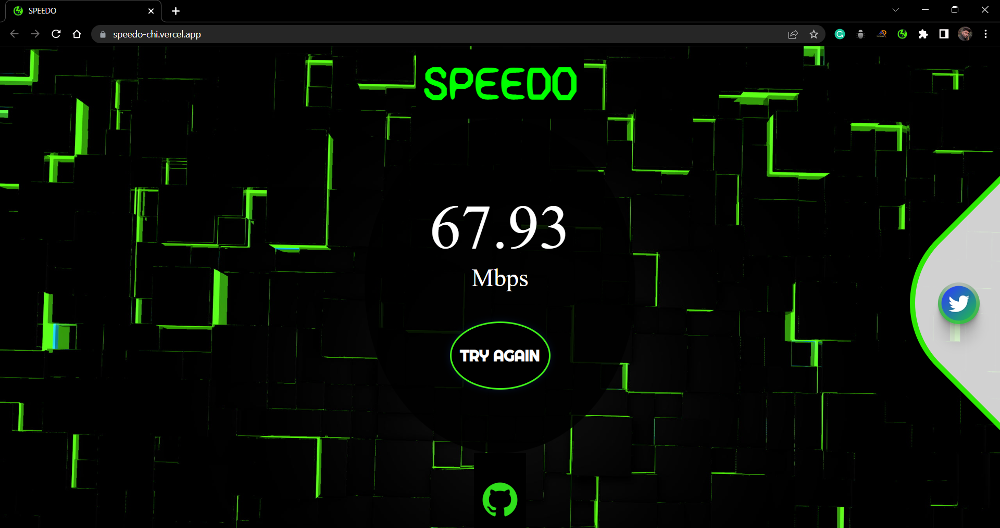
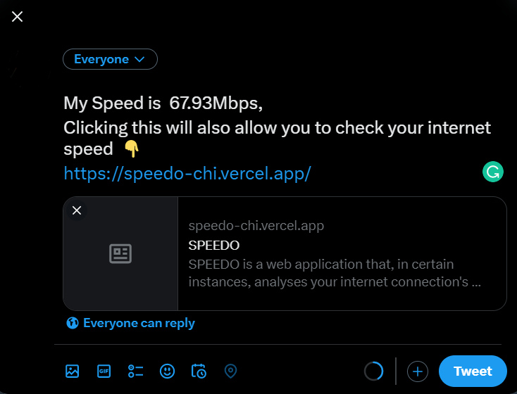

# SPEEDO

SPEEDO is a web application that, in certain instances, analyses your internet connection's speed.

# Screenshot:

       

       

### Referring to the previous image, clicking the Twitter share button creates a Twitter frame where you may post your stats.

       

## Likewise, you may explore this website's Chrome Extension by clicking the link below.👇

link - [SPEEDO-Chrome-Extension](https://github.com/ParamPragyan/SPEEDO-Chrome-Extension)
